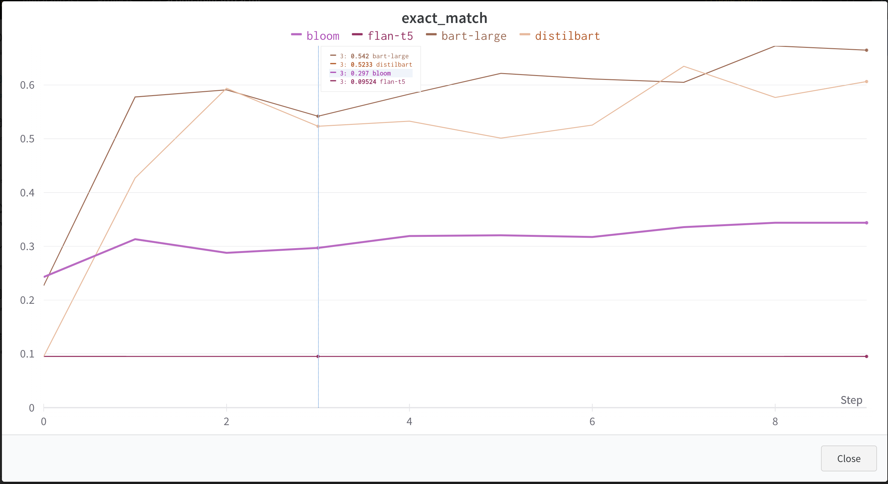

# Action Item Generator

In this document I am going to outline my approach in building a model which is able to take in a transcript of a conversation and generate the action items mentioned in it.

## Data Generation

I have used chatgpt-3.5-turbo model using the openai-api. 
First I tried using structured prompts where I would give the model very specific instructions on how to create the conversation and to extract action items from it.
Here is an example of a structured prompt that I was using:
```
You have to do the following task:
1 - Generate a transcript of a multi-turn conversation for the given scenario.
2 - The conversation should have at least 10 turns.
3 - The agenda of any of the conversations generated should have discussion of action items, which should get assigned to a person.
4 - Find all the action items discussed during the conversation and to whom it was assigned.
An Examples of how each turn of a conversation should look like is given below delimited by <>:
Example: <
“10:00:00”, “10:01:50”, “Bob“, “The QA team did some tests on the latest realease and have found some issues in using the login page.Alice, can you take this UX bug? 
"11:00:00","11:01:30","Ken","The current documentation does not look to be in sync with the latest version of the relase. Jen, can you please update the documentation for the new release",
>

Scenario: standup meet of a AI team, planning for the next sprint.
```
**Drawbacks**: <ul>
<li>A large number of the generated conversations were having very similar structure and words apart from a few key information (due to change in scenario).</li>
<li>The generated conversations always had the same names.</li>
</ul>

The approach that worked out best here is few-shot prompting, as it helped generate a variety of conversations. This is an example of the final prompt that was used to generate data.
```
Scenario: standup meet of backend team for a payment gateway.
 Participants: John, Sarah, David, Emily
 Turns: 10
 10:00:00||10:01:50||John||Good morning everyone, let's start with our daily standup meeting.
 10:02:00||10:03:30||Sarah||I have been working on the transaction module and have completed the integration with the payment gateway.
 10:03:40||10:05:00||David||I have been working on the user authentication module and have found some issues with the password reset functionality.
 10:05:10||10:06:30||John||David can you please create a ticket for this issue and assign it to yourself?
 10:06:40||10:08:00||David||Sure John, I will do that.
 10:08:10||10:09:30||Emily||I have been working on the account balance module and have found some performance issues.
 10:09:40||10:11:00||John||Emily can you please investigate the issue and provide a solution by the end of the day? And Sarah please ghelp Emily if she has any issues.
 10:11:10||10:12:30||Emily||Sure John, I will do that.
 10:12:40||10:14:00||Sarah||I have also found some issues with the transaction history module.
 10:14:10||10:15:30||John||Sure Sarah, I can pick that up? And can someone please create minutes of the meetings.
 Action Items:
 password reset functionality||David
 account balance module||Emily, Sarah
 transaction history module||John
 create minutes of the meetings||UNKOWN

Scenario: Discussing market research findings,Marketing company
Participants : Kayla, Nicole, Tyler, Madison
Turns: 24
```

To achieve a lot more variety in the dataset, we need to have a different names and scenarios. To automate and fasten up the process, I generated a list of 100 names and 20 situations each for a given enviornment, defined  in `data/datagen_vars.yml` . The code for generating different scenarios can be found in `data/scenario_generator.py` .

The datasets can be found in `data/datasets`, here is a brief descritption of each file there:
<ul>
<li> `dialogue.csv` : This contains all the transcriptions and is in the format as specified. I have added on extra column of id to map each row to it's conversation</li>
<li> `labels.json` : This contains the action item for a given conversation id</li>
<li> `scenario.csv` : This contains the list of variables used to create each conversation</li>
</ul>


## Training

I have framed the problem as Sequence to Sequence Problem, where we input the conversation and the model generates a list of Action Items.

I have used the BART model which is an encoder decoder model as it is able to handle longer Sequence and since the average length of our transcription is 279 tokens. So we would not have been able to use LSTM as they suffer wiht information loss on Sequences longer than 256.

We have used multiple models having different architectures and compared them using a custom metric.
We have used the following models:
1. BART (Encoder Decoder Model), checkpoint used: [philschmid/bart-large-cnn-samsum](https://huggingface.co/philschmid/bart-large-cnn-samsum) 
2. DistilBART (Encoder Decoder Model), checkpoint used: [philschmid/distilbart-cnn-12-6-samsum](https://huggingface.co/philschmid/distilbart-cnn-12-6-samsum)
3. Flan-T5 (Encoder Decoder Model), checkpoint used: [philschmid/flan-t5-base-samsum](https://huggingface.co/philschmid/flan-t5-base-samsum)
4. BLOOM LM (Decoder Model), checkpoint used : [bigscience/bloom-560m](https://huggingface.co/bigscience/bloom-560m)

All the Encoder Decoder models were pretrained on the SamSum dataset which is used for dialogue summarization, while BLOOm was trained on general tasks.

Training code can be found inside `training/`

All the trained models can be found on huggingface hub [here](https://huggingface.co/Debal)

Note : have not uploaded the Flan-T5 due it's very poor performance.

## Evaluation
I have written a new custom metric for evaluating the generated action items.
First we get embeddings for all the action item text using the `text-embedding-ada-002` model from openai.
Then we run cosine similarity and have used a threshold of `0.85` , if we found a match then we use a fuzzy match to see if it has been assigned to the right person.
So we have four metrics from this
1. Exact Match 
2. Wrong Assignee
3. Not Found
4. Extra Generated 

Below is a graph showing data for exact match and BART seems to outperform all the models.<br>
<p align="center">

</p>

All the other metrics can be found [here](https://wandb.ai/debalabbas7/action-item-extractor?workspace=user-debalabbas7)
## Refrences

This is the link that was used for [prompt engineering](https://www.deeplearning.ai/short-courses/chatgpt-prompt-engineering-for-developers/)
